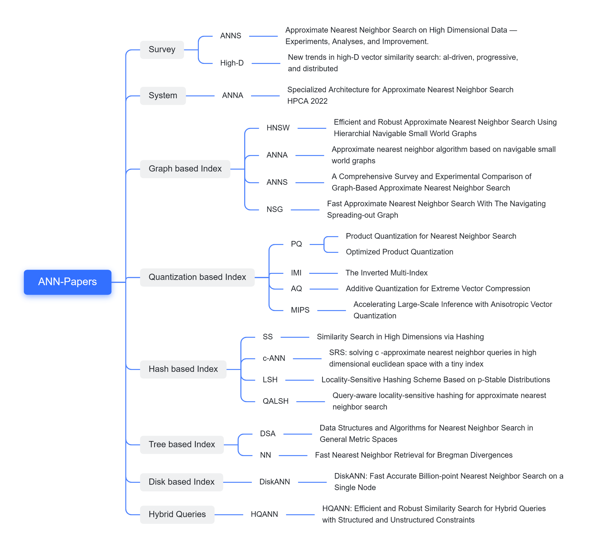

# ANN-Papers

# Introduction

The project is a collection of recent research in areas such as ANN(Approximate Nearest Neighbor) and Vector Database, including research reports, academic papers and datasets etc.

**We also hold regular [paper readings together]((https://github.com/Unstructured-Data-Community/talk/blob/main/paper-reading.md)), so feel free to share your ideas.**

该项目收集了ANN（近似近邻搜索）和向量数据库等领域的最新研究，包括研究报告、学术论文和数据集等。

**我们还会定期举办[论文共读]((https://github.com/Unstructured-Data-Community/talk/blob/main/paper-reading.md))活动，欢迎共同交流.**

# Contribution

Contributions are always welcome! Make an individual pull request for each suggestion.

# Content

- [1. Survey](https://github.com/Unstructured-Data-Community/ANN-Papers#1-survey-more)
- [2. System](https://github.com/Unstructured-Data-Community/ANN-Papers#2-system-more)
- [3. Graph based Index](https://github.com/Unstructured-Data-Community/ANN-Papers#3-graph-based-index-more)
- [4. Quantization based Index](https://github.com/Unstructured-Data-Community/ANN-Papers#4-quantization-based-index-more)
- [5. Hash based Index](https://github.com/Unstructured-Data-Community/ANN-Papers#5-hash-based-index-more)
- [6. Tree based Index](https://github.com/Unstructured-Data-Community/ANN-Papers#6-tree-based-index-more)
- [7. Disk based Index](https://github.com/Unstructured-Data-Community/ANN-Papers#7-disk-based-index-more)
- [8. Hybrid Queries](https://github.com/Unstructured-Data-Community/ANN-Papers#8-hybrid-queries-more)

## Must-read papers for beginners

### [1. Survey](./content/Survey.md)

[1] **Approximate Nearest Neighbor Search on High Dimensional Data — Experiments, Analyses, and Improvement** TKDE 2020. [paper](https://arxiv.org/pdf/1610.02455.pdf)

*Wen Li, Ying Zhang , Yifang Sun, Wei Wang, Mingjie Li , Wenjie Zhang , Xuemin Lin*

---

[2] **New trends in high-D vector similarity search: al-driven, progressive, and distributed** VLDB 2021. [paper](http://vldb.org/pvldb/vol14/p3198-echihabi.pdf) [slid](https://vldb.org/2021/files/slides/tutorial/tutorial5.pdf)

*Karima Echihabi, Kostas Zoumpatianos, Themis Palpanas*

---

### [2. System](./content/System.md)

[1] **ANNA: Specialized Architecture for Approximate Nearest Neighbor Search** HPCA 2022. [paper](https://ieeexplore.ieee.org/document/9773206)

*Yejin Lee, Hyunji Choi, Sunhong Min and so on*

---

### [3. Graph based Index](./content/Graph-based-Index.md)

[1] **Efficient and Robust Approximate Nearest Neighbor Search Using Hierarchial Navigable Small World Graphs** [paper](https://arxiv.org/pdf/1603.09320.pdf)

*Yu A. Malkov, D. A. Yashunin*

---

[2] **Approximate nearest neighbor algorithm based on navigable small world graphs** Information Systems 2014. [paper](https://www.sciencedirect.com/science/article/abs/pii/S0306437913001300)

*Yury Malkov, Alexander Ponomarenko, Andrey Logvinov, Vladimir Krylov*

---

[3] **A Comprehensive Survey and Experimental Comparison of Graph-Based Approximate Nearest Neighbor Search** VLDB 2022. [paper](https://arxiv.org/pdf/2101.12631v1.pdf)

*Mengzhao Wang, Xiaoliang Xu, Qiang Yue, Yuxiang Wang*

---

[4] **Fast Approximate Nearest Neighbor Search With The Navigating Spreading-out Graph** VLDB 2019. [paper](https://arxiv.org/pdf/1707.00143.pdf)

*Cong Fu, Chao Xiang, Changxu Wang, Deng Cai*

---

### [4. Quantization based Inde](./content/Quantization-based-Index.md)

[1] **Product Quantization for Nearest Neighbor Search** TPAMI 2019. [paper](https://hal.inria.fr/inria-00514462v2/document)

*Herve J ´ egou, Matthijs Douze, Cordelia Schmid*

---

[2] **Optimized Product Quantization** TPAMI 2013. [paper](https://ieeexplore.ieee.org/document/6678503)

*Tiezheng Ge, Kaiming He, Qifa Ke, Jian Sun*

---

[3] **The Inverted Multi-Index** TPAMI 2014. [paper](https://ieeexplore.ieee.org/document/6915715)

*Artem Babenko, Victor Lempitsky*

---

[4] **Additive Quantization for Extreme Vector Compression** CVPR 2014. [paper](https://ieeexplore.ieee.org/document/6909519/)

*Artem Babenko, Victor Lempitsky*

----

[5]**Accelerating Large-Scale Inference with Anisotropic Vector Quantization** ICML 2020. [paper](https://arxiv.org/pdf/1908.10396.pdf)

*Ruiqi Guo, Philip Sun, Erik Lindgren*

---

### [5. Hash based Index](./content/Hash-based-Index.md)

[1] **Similarity Search in High Dimensions via Hashing** VLDB 1999. [paper](https://www.vldb.org/conf/1999/P49.pdf)

*Aristides Gionis, Piotr Indyk, Rajeev Motwani*

---

[2] **SRS: solving c -approximate nearest neighbor queries in high dimensional euclidean space with a tiny index** VLDB 2014. [paper](https://vldb.org/pvldb/vol8/p1-sun.pdf)

*Yifang Sun, Wei Wang, Jianbin Qin, Ying Zhang, Xuemin Lin*

---

[3] **Locality-Sensitive Hashing Scheme Based on p-Stable Distributions** SCG 2004.[paper](https://dl.acm.org/doi/10.1145/997817.997857)

*Mayur Datar, Nicole Immorlica, Piotr Indyk, Vahab S. Mirrokni*

---

[4] **Query-aware locality-sensitive hashing for approximate nearest neighbor search** VLDB 2015. [paper](https://dl.acm.org/doi/10.14778/2850469.2850470)

*Qiang Huang, Jianlin Feng, Yikai Zhang*

---

### [6. Tree based Index](./content/Tree-based-Index.md)

[1] **Data Structures and Algorithms for Nearest Neighbor Search in General Metric Spaces** SODA 1993. [paper](https://dl.acm.org/doi/pdf/10.5555/313559.313789)

*Peter N. Yianilos*

---

[2] **Fast Nearest Neighbor Retrieval for Bregman Divergences** ICML 2008. [paper](https://dl.acm.org/doi/10.1145/1390156.1390171)

*Lawrence Cayton*

---

### [7. Disk based Index](./content/Disk-based-Index.md)

[1] **DiskANN: Fast Accurate Billion-point Nearest Neighbor Search on a Single Node** NIPS 2019. [paper](https://dl.acm.org/doi/pdf/10.5555/3454287.3455520)

*Suhas Jayaram Subramanya, Devvrit, Rohan Kadekodi, Ravishankar Krishaswamy, Harsha Vardhan Simhadri*

---

### [8. Hybrid Querie](./content/Hybrid-Queries.md)

[1] **HQANN: Efficient and Robust Similarity Search for Hybrid Queries with Structured and Unstructured Constraints** CIKM '22. [paper](https://arxiv.org/pdf/2207.07940.pdf)

*Wei Wu, Junlin He, Yu Qiao, Guoheng Fu, Li Liu, Jin Yu*
___

## Project initiator
| 姓名 | 介绍 | 简介 | 联系 |
| :-------------------------: | :----------------------------: | :--------------------------: | :-------------: |
| 苏鹏 | Datawhale 成员，东北大学硕士 | https://github.com/SuperSupeng | wechat: subranium |
| 王梦召 | 浙江大学博士 |  |  |
| 张鹏程 | 上海交通大学博士 |  |  |
| 王泽宇 | 复旦大学博士 |  |  |
| 田冰 | 华中科技大学博士 |  | |

## WeChat Group

扫描下方二维码关注公众号：向量检索实验室（发送“加入社群”进入交流群）

## LICENSE

[Apache-2.0 license](./LICENSE)
